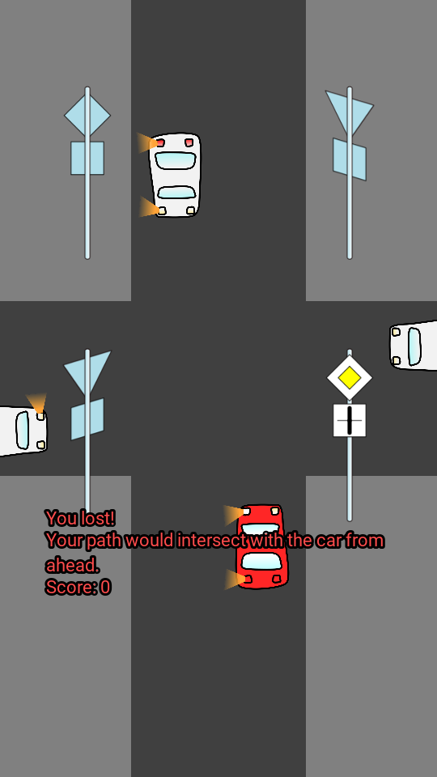

Yield or Die! Train yourself to learn rules for right-of-way, 
without spending lots of money for practice at driving school!

Disclaimer: learn at your own risk.

Copyright (C) 2021 Dan Gheorghe Haiduc (aka danuker)

This program is free software: you can redistribute it and/or modify
it under the terms of the GNU General Public License as published by
the Free Software Foundation, either version 3 of the License, or
(at your option) any later version.

This program is distributed in the hope that it will be useful,
but WITHOUT ANY WARRANTY; without even the implied warranty of
MERCHANTABILITY or FITNESS FOR A PARTICULAR PURPOSE.  See the
GNU General Public License for more details.

You should have received a copy of the GNU General Public License
along with this program.  If not, see <https://www.gnu.org/licenses/>.

----

That said, the author personally used this software to efficiently practice,
and is now the proud owner of a driver's license (4th time was the charm).

The rules were written for Romania, but they are probably very similar 
for many jurisdictions. Romania has ratified the [Vienna Convention on Road Signs and Signals](https://en.wikipedia.org/wiki/Vienna_Convention_on_Road_Signs_and_Signals).

I would greatly appreciate confirmation from various countries!

The implemented rules are:

1. If there are no other cars that would intersect your path, you must go through.
2. If you are the only one with a right-of-way/priority sign, you must go through first.
3. If the other cars have a yield sign and you don't, then you must also go through first.
4. If everyone has the same level of right-of-way, then you must yield to the vehicle coming from your right, if there is one.
  - There are two kinds of "coming from your right":
    - before you enter the intersection, the car is on the road to your right
    - after you enter the intersection, you would turn left (and a car is coming from the road ahead or from the right). This way, if you were to go left, the other car coming from ahead (North) would hit your right.
5. If you are opposite of someone and both of you want to turn left, in this game you must yield. In practice though, you might be able to go through if both of you keep left of the intersection's center. But I didn't want to code this in the game, and I wouldn't do it in reality either.

I appreciate contributions, especially for inclusion in [F-Droid](https://f-droid.org/).

Contents:

- [Installation](#installation)
- [Feature wishlist](#feature-wishlist)

# Installation

You need Kivy, Buildozer, and JDK 8.

- Install OS dependencies first
    - For Arch Linux these are: `sudo pacman -Syu android-tools sdl2 sdl2_image sdl2_mixer sdl2_ttf`

- Then Python dependencies; rebuilds Kivy because of audio bug in Pip binary
    - `pip install -r requirements.txt`

After you install the dependencies, you can run using:

`python main.py`

But the project is more fun on a mobile phone. Read further.

## You need JDK 8

Android requires JDK.

Since Oracle [changed its license](https://www.oracle.com/java/technologies/javase-jdk8-downloads.html)
for newer versions of `openjdk-8-jdk`,
I point anyone interested to an alternate implementation of JDK 8, which got me past an error:

[AdoptOpenJDK](https://adoptopenjdk.net/installation.html)

## Deploy on Android

To deploy on Android, you need `adb` and other tools in the Android SDK.

When opening a new console, before doing any Buildozer commands, you need AdoptOpenJDK in the path.
If you got the `jdk8u242-b08` directory:

    export PATH=$PWD/jdk8u242-b08/bin:$PATH

After changing `buildozer.spec`, you might need to run:

    buildozer appclean

To show devices:

    adb devices

Check that the device is visible (search for the error if you do not see similar output):

    List of devices attached
    6b7fa94 device

Finally, deploy to the device:

    buildozer android debug deploy run

This will take a while the first time; Buildozer has a lot of dependencies,
including the Android SDK for which there are two (??) license agreements.

On my 6-year-old laptop it took 40 minutes.

Compilation will use CPU; make sure you have adequate cooling and/or thermal throttling. 

## Regenerating images

If you edit the graphics, you need to generate PNGs from the SVGs,
because Kivy does not support SVG, and SVG has superior editability.

This requires commands from the `imagemagick` package: `mogrify` and `convert`.
To perform it:

    cd pics/
    ./generate_pngs.sh
    

Because the vast majority of people will not edit the graphics,
the PNGs are in the Git repo as well (whole project is under 3MB anyway).

# Feature wishlist

See [ticket #1](https://github.com/danuker/yield-or-die/issues/1).
